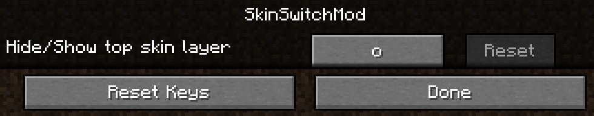
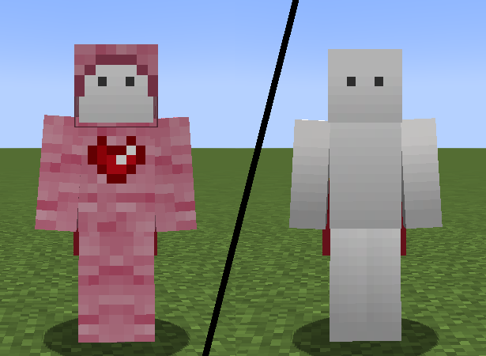

# SkinSwitchMod
This is a Minecraft **1.19.1** mod using fabric.
The repository has two separated branches.

## Overview

### _The main branch_

This branch is the "public" version of the mod. It has only one basic feature.
The feature adds a key binding that allow the user to hide/show its top skin layer. The player's cape is not affected. Maybe I'll add this as an option in the future.

### _The privateUseModVersion branch_

This branch has the same feature as the main one, but it adds a feature more specific to my own skin.
It is now possible for other players to hide my skin by holding a shear in their main hand and sneaking. The reason I made this is that my skin is made of wool.

## Other

### _Installation_

The mod has no dependency. Just download it and paste it in your mod folder. Then start your Minecraft client with Fabric 1.19.1. 
I did not try to use the mod in 1.19 or 1.19.2 but some mods support it.

### _Repository forking_

Feel free to edit any branch of the mod to add features or improve the code. I am not familiar with doing mods, so I probably wrote low quality code. In addition, I have not used java since many months, so I did not always follow object oriented best practices.